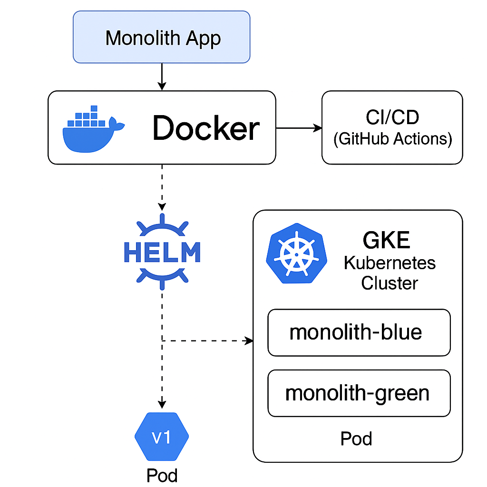

# 🚀 Kubernetes Migration Demo

[](https://github.com/<your-username>/kubernetes-migration-demo/actions)
[](LICENSE)

This project demonstrates the **migration of a monolithic Flask application** to a Kubernetes environment using:

- ✅ **Docker + GCR** for image hosting  
- ✅ **Helm** for blue-green deployment  
- ✅ **GKE** (Google Kubernetes Engine) for orchestration  
- ✅ **GitHub Actions** for CI/CD  
- ✅ (Optional) **Terraform** for infrastructure provisioning

---

## 📦 Folder Structure

```
kubernetes-migration-demo/
├── flask-app/              # Flask monolith app (Dockerized)
├── monolith-chart/         # Helm chart for blue-green deployment
├── .github/workflows/      # GitHub Actions CI/CD pipeline
├── terraform/              # (Optional) GKE Infra via Terraform
├── architecture-diagram.png
└── README.md
```

---

## 📸 Architecture Diagram

> 

---

## 🚀 Live Demo

Tested using:

- 🔹 GKE cluster manually deployed via Cloud Shell
- 🔹 `monolith-blue` and `monolith-green` pods
- 🔹 Image versions: `v1` and `v2` pushed to GCR

---

## 🐳 Build & Push Docker Image

```bash
cd flask-app/
docker build -t gcr.io/<your-project-id>/monolith-app:v1 .
docker push gcr.io/<your-project-id>/monolith-app:v1
```

Repeat for v2 after editing `VERSION`.

---

## ⎈ Helm Deployment to GKE

```bash
helm install monolith-blue ./monolith-chart --set image.tag=v1
helm upgrade --install monolith-green ./monolith-chart --set image.tag=v2 --set replicaCount=3
```

---

## 🤖 GitHub Actions CI/CD

Trigger on every push to `main`:
- Builds Docker image
- Pushes to GCR
- Deploys via Helm to GKE

---


---

## 🌱 Optional Terraform (Infra-as-Code)

The `terraform/` folder contains scripts to provision:
- VPC, GKE Cluster, Node Pool, and IAM roles

---

## 📄 License

MIT License © Kshitija Randive
